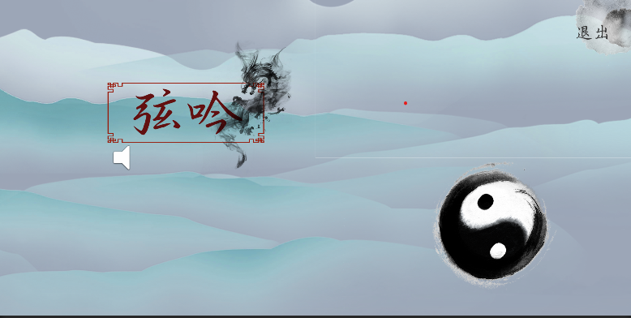
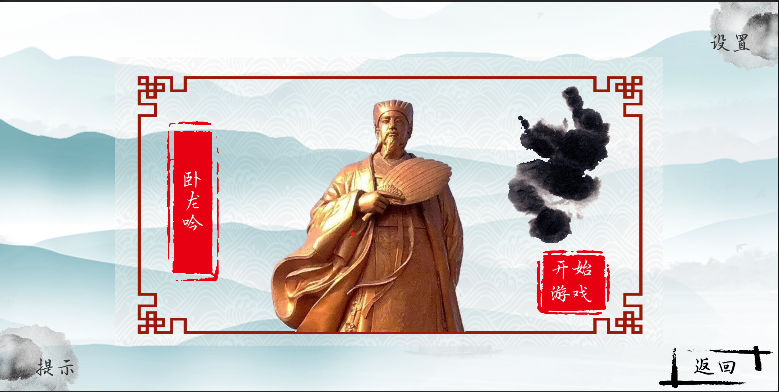
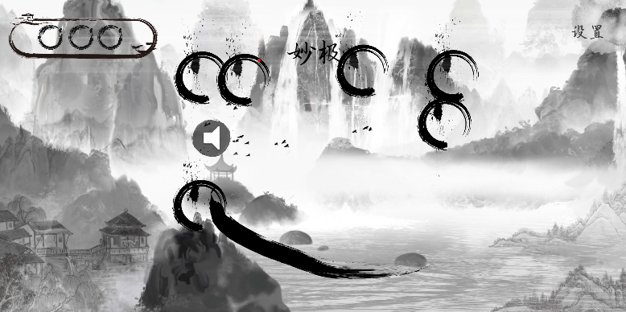

# 弦吟demo

> ⚠️ **项目性质声明**
> 
> 本项目为**个人学习作品**，其中的美术资源（图片/音效/模型）部分来源于网络公开素材，**仅用于技术演示**，不构成商业授权。
> 
> 完整版权声明详见 [DISCLAIMER.md](./DISCLAIMER.md)。

#### 介绍

一个音乐节奏游戏。

结合了《水果忍者》和音乐节奏而设计的新颖玩法。

采用东方水墨素材，展现东方审美。

#### 关键词
节奏，切割音符，水墨

#### 游戏内容展示

+ 开始界面

+ 音乐选择界面

+ 游戏内实机演示

#### 安装教程

1.下载apk安装包安装即可使用

#### 注意事项

+ 作品尚不完整，未来如有机会，会继续更新内容