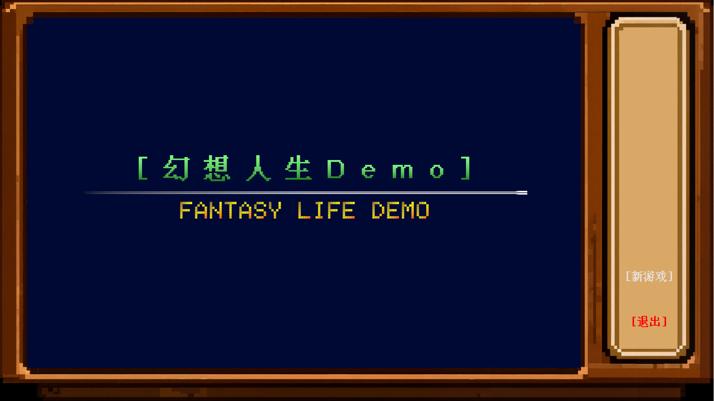
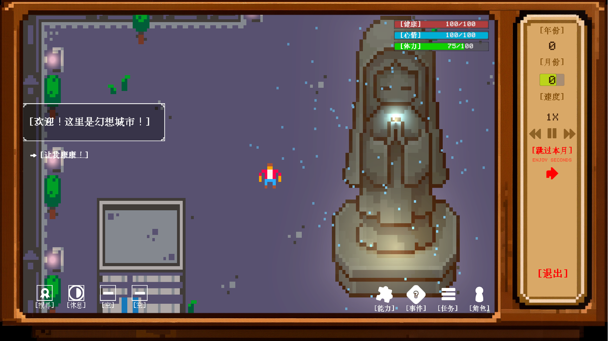
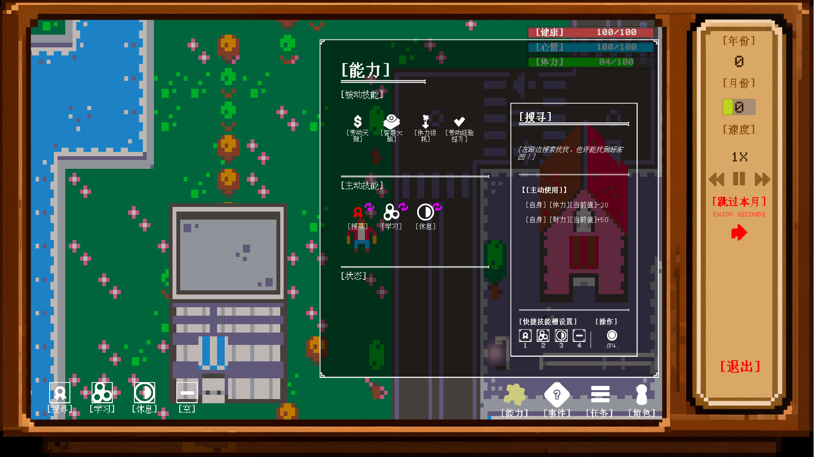
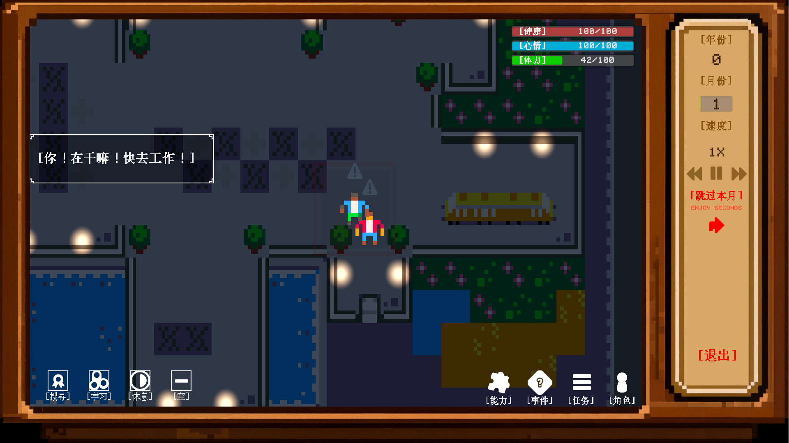

## 《幻想人生》Demo

> ### ⚠️版本说明
> 本目录下发布的 `.exe` 文件为**体验版 Demo**，核心源码暂不开源。
> ### 许可证
> - **Demo 可执行文件**：仅供个人体验，未经授权不得转载、反编译或用于商业目的。
> - **美术资源**：来源于 Unity Asset Store 和 Kenney 的免费/可商用资源，部分为原创，遵循其各自许可。
> - **原创代码**：待 v1.0 正式版发布后，届时考虑以 **GPL-3.0 协议**开源。
> ### 开发者
> - 策划/程序/美术：brandgod

#### 介绍

欢迎来到“幻想城市”！

在像素风的世界里，体验“幻想人生”。 

没有成功和失败，只有体验与经历。

_（内容和设定暂不公开，等待作品更加完整时，再行展示，敬请期待）_

#### 关键词

沙盒、RPG、幻想、人生、模拟、修仙

#### 游戏内容展示

+ 开始界面

+ 欢迎进入世界

+ 能力系统

+ 公司内部场景

#### 体验方式

1. 克隆本仓库到本地
2. 运行SimpleLife.exe即可

